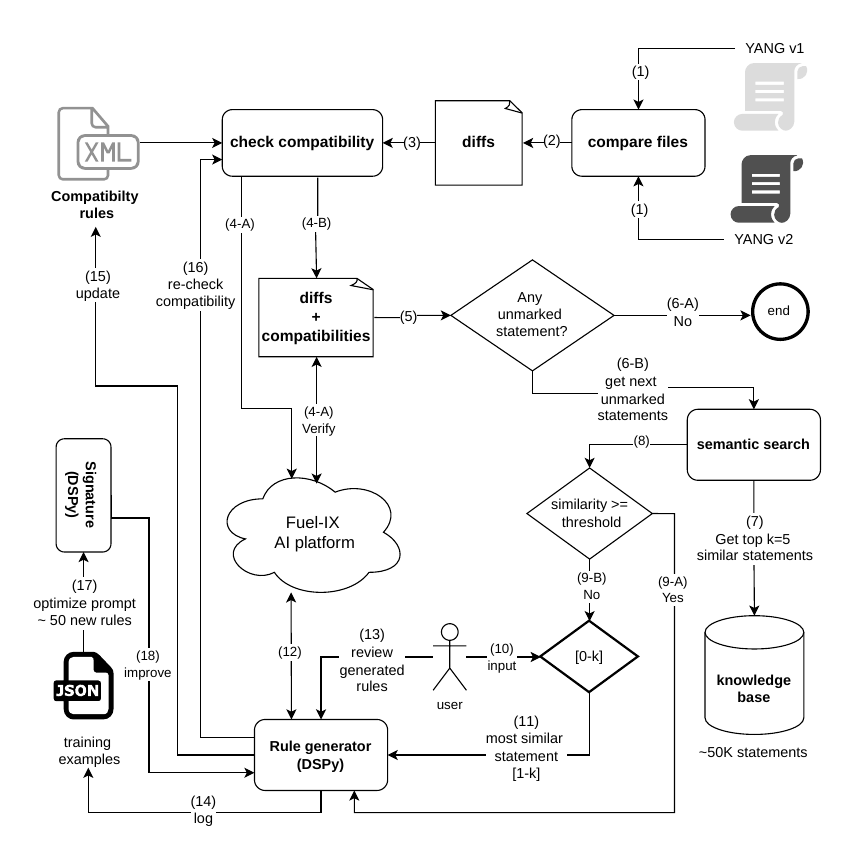

# YANG-Evolve

> Production-Grade YANG Schema Compatibility Checker with RAG-Powered Self-Learning

> **Status**: ✅ Production Ready
> **Version**: 1.0.0
> **Package**: `yang-comparator-pro`
> **Architecture**: Deterministic Rule-Based Layer + RAG-Based Self-Learning Layer

---

## 🎯 Overview

**YANG-Evolve** is a plugin for [Pyang](https://github.com/mbj4668/pyang) that provides semantic backward compatibility verification for evolving YANG models. It combines deterministic compatibility analysis with a RAG-powered self-learning pipeline for handling previously unseen vendor-specific YANG extensions.

1. **Deterministic Layer (Phase 1)** — Rule-based comparator applies XML compatibility rules (RFC 7950) to classify every detected diff as Backward-Compatible (BC) or Non-Backward-Compatible (NBC).
2. **RAG-Based Self-Learning Layer (Phase 2)** — When the rule engine encounters `[UNMARKED]` statements it cannot classify, it automatically triggers a RAG (Retrieval-Augmented Generation) search that finds the top-K semantically similar known YANG statements from a pre-built embedding index (~50K statements) and uses an LLM (via DSPy) to generate new compatibility rules on the fly.

> 📄 **Full PDF**: [`docs/diff-rag-pipeline.pdf`](docs/diff-rag-pipeline.pdf)

<p align="center">
  
</p>

**Key Features:**
- ✨ Rule-based comparator with XML compatibility rules (RFC 7950)
- 🔍 **Phase 2 RAG**: automatic retrieval of top-K similar statements for any `[UNMARKED]` change
- 🤖 Optional LLM verification for complex edge cases (`when`/`must`/`pattern`/`range`)
- 📋 RFC 7950 strict compatibility mode support
- 📊 Detailed compatibility reports (JSON + human-readable)
- 🔌 Works as both standalone CLI tool and pyang plugin
- 🌍 Cross-platform: Linux, Windows, macOS
- 📦 pip-installable package

---

## � Related Work / Paper

### YANG-Evolve: Agent-Orchestrated Semantic Backward Compatibility Verification for Evolving YANG Models

- Conference: CNSM 2026
- Venue page: https://www.cnsm-conf.org/2026/index.html
- Focus: Semantic backward compatibility verification for evolving YANG models

This paper presents a broader semantic verification framework for evolving YANG models, covering the core methodology, evaluation design, and validation strategy.

---

## �🚀 Quick Start

### Installation

#### Option 1: Build and Install from Source (Recommended)

```bash
# Build the wheel (from the project root)
python -m build

# Install the generated wheel (includes pre-built RAG index — no rebuild needed)
pip install dist/yang_comparator_pro-1.0.0-py3-none-any.whl
```

The wheel registers the pyang plugin automatically via the package entry point — no separate install step is needed.

#### Option 2: Minimal install (no RAG/ML)

The wheel's core dependencies (`pyang`, `lxml`, `rich`, `interegular`, `dspy-ai`, `openai`) are installed automatically — no RAG/ML packages are pulled in unless you explicitly request the `[rag]` extras:

```bash
python -m build
pip install dist/yang_comparator_pro-1.0.0-py3-none-any.whl
# RAG extras (sentence-transformers, torch, numpy) are NOT installed by default
```

---

## 📖 Usage

### Method 1: Standalone CLI Tool

After installation, use the `yang-comparator` (or `yang-compare`) command:

```bash
# Basic comparison
yang-comparator old.yang new.yang old_dir new_dir

# With RFC 7950 strict mode
yang-comparator old.yang new.yang old_dir new_dir --rfc7950

# Custom output location
yang-comparator old.yang new.yang old_dir new_dir --out my_output/report.json
```

### Method 2: Pyang Plugin Integration

After installing the wheel, use via pyang:

```bash
# Basic comparison
pyang --check-compatibility \
      --old-version old.yang \
      --new-version new.yang \
      --old-dir old_dir \
      --new-dir new_dir

# With RFC 7950 strict mode
pyang --check-compatibility \
      --old-version old.yang \
      --new-version new.yang \
      --old-dir old_dir \
      --new-dir new_dir \
      --rfc7950

# Custom output directory
pyang --check-compatibility \
      --old-version old.yang \
      --new-version new.yang \
      --old-dir old_dir \
      --new-dir new_dir \
      --output-dir my_output

# With LLM verification for complex cases
pyang --check-compatibility \
      --old-version old.yang \
      --new-version new.yang \
      --old-dir old_dir \
      --new-dir new_dir \
      --llm-verify \
      --llm-model claude-sonnet-4-6

# With a custom compatibility rules file
pyang --check-compatibility \
      --old-version old.yang \
      --new-version new.yang \
      --old-dir old_dir \
      --new-dir new_dir \
      --xml-rules /path/to/my_rules.xml
```

**Real-world example** (OpenConfig ACL module):

```bash
pyang --check-compatibility \
      --old-version openconfig-acl.yang \
      --new-version openconfig-acl.yang \
      --old-dir workspace/exports/4e76bba53d6aee0ad2c4d3c42ecdf9b0ffc69296/old/release/models/acl \
      --new-dir workspace/exports/4e76bba53d6aee0ad2c4d3c42ecdf9b0ffc69296/new/release/models/acl \
      --llm-verify \
      --llm-model claude-sonnet-4-6
```

#### Pyang Plugin Options Reference

| Option | Default | Description |
|--------|---------|-------------|
| `--check-compatibility` | — | **Required.** Activates the plugin |
| `--old-version <file>` | — | **Required.** Old YANG module filename |
| `--new-version <file>` | — | **Required.** New YANG module filename |
| `--old-dir <path>` | — | **Required.** Directory with old module + dependencies |
| `--new-dir <path>` | — | **Required.** Directory with new module + dependencies |
| `--output-dir <path>` | `output` | Directory for all generated reports |
| `--rfc7950` | off | Enable RFC 7950 strict compatibility mode |
| `--llm-verify` | off | Enable LLM verification for complex edge cases (`when`/`must`/`pattern`/`range`) |
| `--llm-model <name>` | `gpt-4o-mini` | LLM model name (any OpenAI-compatible model) |
| `--xml-rules <file>` | bundled | Path to a custom `compatibility_rules.xml` |
| `--rag-top-k <N>` | `5` | Number of top-K RAG candidates shown per unmarked keyword in Phase 2. Phase 2 runs **automatically** whenever `[UNMARKED]` statements are found — no extra flag needed. |

#### Full Pipeline: Phase 1 (comparator) + Phase 2 (RAG for unmarked)

Phase 2 runs **automatically** after Phase 1 whenever `[UNMARKED]` statements are found in `final_report.json`. No extra flag is needed:

```bash
# Standard run — Phase 2 triggers automatically if there are [UNMARKED] statements
pyang --check-compatibility \
      --old-version openconfig-acl.yang \
      --new-version openconfig-acl.yang \
      --old-dir old_dir \
      --new-dir new_dir

# Adjust the number of RAG candidates shown per keyword (default: 5)
pyang --check-compatibility \
      --old-version openconfig-acl.yang \
      --new-version openconfig-acl.yang \
      --old-dir old_dir \
      --new-dir new_dir \
      --rag-top-k 10
```

**What happens automatically (step by step):**

1. **Phase 1** — Rule-based comparator runs; generates `final_report.json`
2. **Check for `[UNMARKED]`** — If none found, pipeline ends here
3. **Load covered keywords** — Parses `compatibility_rules.xml` to build the set of already-known keywords (grows automatically as rules are added — no hardcoded list)
4. **For each uncovered keyword** — Calls `experiment_rag_candidates.py` which:
   - Queries the bundled RAG embedding index for the top-K most similar known YANG keywords
   - Displays a ranked table of candidates with similarity scores
   - Lets the user pick the best match (with an edit option); press `Ctrl+C` to skip
   - Clones the matching rules into `compatibility_rules.xml` (with `.xml.bak` backup)
5. **Phase 2 rerun** — Reruns the comparator with the updated rules; reports how many previously-unmarked statements are now classified

**Prerequisites for Phase 2:**

The RAG index is **already bundled** in the wheel (`data/index/`). The only prerequisite is an API key for LLM-assisted rule generation:

```bash
# Set your API key (any OpenAI-compatible endpoint)
export FUELIX_API_KEY="your-key-here"
# or
export OPENAI_API_KEY="your-key-here"
```

If the API key is not set, Phase 2 will print a warning and skip gracefully — the Phase 1 report is still complete and usable.

### Method 3: Python API

```python
from yang_rag.comparator.cli import run_pipeline

result = run_pipeline(
    yang_old="old.yang",
    yang_new="new.yang",
    dir_old="old_dir",
    dir_new="new_dir",
    out_json="output/final_report.json",
    compatibility_flag="rfc7950",   # Optional: RFC 7950 strict mode
)
```

### Updating the Pyang Plugin

The plugin is registered automatically when the wheel is installed. To update it after making source changes, rebuild and reinstall the wheel:

```bash
python -m build
pip install dist/yang_comparator_pro-1.0.0-py3-none-any.whl --force-reinstall --no-deps

# Verify the plugin is active
pyang --help | grep check-compatibility
```

---

## 🔧 Advanced Features

### LLM Verification (Optional)

For complex edge cases that require deeper semantic analysis:

```bash
# Set API credentials (FuelIX OpenAI-compatible endpoint)
export FUELIX_API_KEY="your-api-key"
# Or use a standard OpenAI key
export OPENAI_API_KEY="your-openai-key"

# Run comparison with LLM verification via pyang plugin
pyang --check-compatibility \
      --old-version old.yang \
      --new-version new.yang \
      --old-dir old_dir \
      --new-dir new_dir \
      --llm-verify \
      --llm-model claude-sonnet-4-6

# Or with standalone CLI
yang-comparator old.yang new.yang old_dir new_dir \
      --llm-verify --llm-model claude-sonnet-4-6
```

**When LLM verification runs:**
Only lines tagged `<needs-deep-analysis>` in the enriched report are sent to the LLM. These are constraints (`when`/`must`/`pattern`/`range`) where the rule-based `condition_analyzer` could not determine backward compatibility with certainty.

**LLM verification outputs in `final_report.json`:**

Each non-compatible constraint gains an `llm_assistance_decision` field:
- `"confirmed"` — LLM agrees the change is non-backward-compatible
- `"unconfirmed"` — LLM classifies the change as backward-compatible (the rule-based decision is questionable)
- `"none"` — LLM verification was not run for this item

```json
{
  "constraint": "when",
  "action": "changed",
  "old_value": "../../config/type='ACL_IPV4'",
  "new_value": "../../../config/type='ACL_IPV4'",
  "llm_assistance_decision": "confirmed"
}
```

**Supported LLM models:**
Any model accessible through an OpenAI-compatible API endpoint. Examples:
- `claude-sonnet-4-6` (via FuelIX or Anthropic-compatible proxy)
- `gpt-4o`, `gpt-4o-mini` (OpenAI)
- Any local model served via `ollama` or `llama.cpp` with an OpenAI-compatible layer

**Note**: LLM verification is completely optional. The tool works perfectly without it for standard compatibility checking.

---

## 🗄️ RAG Knowledge Base & Phase 2 Pipeline

### Phase 2 — Automatic RAG for Unmarked Statements

When the comparator pipeline finishes and the `final_report.json` contains any `unmarked` entries, Phase 2 automatically kicks in:

1. Each `unmarked` keyword is queried against the RAG embedding index
2. The top-K most semantically similar known YANG keywords are returned (with similarity scores)
3. The best match is used to clone existing rules from `compatibility_rules.xml` for the new keyword
4. The updated rules are saved (with automatic `.xml.bak` backup)

**Standalone Phase 2 (manual trigger):**

```bash
# For a single unmarked keyword
python3 -m yang_rag.dspy.simple_rule_updater_cli "posix-pattern" \
    --xml yang_rag/comparator/compatibility_rules.xml

# Interactive: shows top-5 similar keywords, prompts for confirmation
# Press Ctrl+C to skip a keyword
```

---

### Full RAG Setup (copy-paste)

```bash
# 1. Build and install the full package (includes RAG dependencies)
python -m build
pip install dist/yang_comparator_pro-1.0.0-py3-none-any.whl

# 2. Extract all YANG files from yang_data/
python -m yang_rag.parsing.pyang_extractor

# 3. Build the embedding index (GPU recommended)
python -m yang_rag.rag.indexer --use-gpu --model all-MiniLM-L6-v2 --batch-size 256

# 4. Set API key for LLM rule generation
export FUELIX_API_KEY="your-key-here"
```

After these steps, the RAG pipeline is ready. Any `[UNMARKED]` statements in the comparator output will automatically trigger Phase 2 retrieval.

---

## 🏗️ Building from Source

```bash
# Clone repository
git clone <repository-url>
cd yang-rag-diff-tool

# Install build dependencies
pip install build twine

# Build the package
python -m build

# Install locally
pip install dist/yang_comparator_pro-1.0.0-py3-none-any.whl
```

---

## 📦 Package Distribution

### Building a Distributable Package

```bash
# Install build tools
pip install build

# Build both wheel and sdist (output goes to dist/)
python -m build

# Or use the provided script
chmod +x build_package.sh
./build_package.sh
```

The wheel (`yang_comparator_pro-1.0.0-py3-none-any.whl`, ~147 MB) includes:
- All Python packages (`yang_rag/` tree)
- The pre-built RAG index (`data/index/` — embeddings, metadata, sentence-transformer model)
- The extracted YANG corpus (`data/yang_pyang_extracted.json`)

### Installing the Wheel on a New Machine

```bash
# 1. Install the wheel (includes pre-built RAG index — no rebuild needed)
pip install yang_comparator_pro-1.0.0-py3-none-any.whl

# 2. Verify (the pyang plugin is registered automatically by the wheel)
pyang --help | grep check-compatibility
yang-comparator --help
```

`yang_rag/config.py` automatically finds the bundled index, so Phase 2 works immediately without any additional setup.

### Rebuilding the RAG Index (optional — for your own YANG files)

If you want to index your own YANG files instead of using the bundled index:

```bash
# Place your YANG files under yang_data/, then:
python -m yang_rag.parsing.pyang_extractor
python -m yang_rag.rag.indexer --use-gpu --model all-MiniLM-L6-v2 --batch-size 256
```

The tool will use the local `data/` directory (project root) in preference to the installed one.

### Package Information

- **Package Name**: `yang-comparator-pro`
- **Version**: 1.0.0
- **Wheel Size**: ~147 MB (includes pre-built RAG index)
- **Python**: >=3.9
- **Core Dependencies**: pyang, lxml, rich, interegular, dspy-ai, openai
- **RAG Dependencies** (bundled in wheel): sentence-transformers model, embeddings, metadata

---

## 📊 Understanding the Output

The comparator generates several report files in the output directory:

### Generated Files

```
output/
├── report.txt                    # Raw diff output
├── filtered_report.txt           # Filtered changes
├── enriched_report_llm.txt       # Detailed analysis with compatibility tags
├── compatible_list.txt           # All backward-compatible changes
├── non_compatible_list.txt       # All breaking changes
├── final_report.json             # Machine-readable JSON report (grouped by path)
└── concise_final_report.json     # Condensed report (renames detected, duplicates merged)
```


### Compatibility Tags

- `[BACKWARD-COMPATIBLE]`: Safe changes that do not break existing clients
- `[NON-BACKWARD-COMPATIBLE]`: Breaking changes that require client updates
- `[UNMARKED]`: No matching rule found — Phase 2 RAG retrieval is triggered

---

## 📁 Project Structure

```
yang-rag-diff-tool/
├── README.md                           # This file
├── LICENSE                             # Apache 2.0 license
├── pyproject.toml                      # Package metadata and entry points
├── build_package.sh / build_package.bat
│
├── docs/
│   └── diff-rag-pipeline.pdf        # Architecture diagram (two-layer pipeline)
│
├── test_tool/                          # Demo test suite (see test_tool/README.md)
│   ├── test_yang_models/               # Old (baseline) YANG modules
│   ├── test_yang_models_v2/            # New (revised) YANG modules
│   ├── results/                        # Pre-generated comparison outputs
│   └── compatibility_rules.xml         # Local rules file for test scenarios
│
├── yang_rag/
│   ├── comparator/                     # ── Phase 1: Deterministic Layer ──────────────
│   │   ├── pyang_plugin.py             # ← Active pyang plugin (--check-compatibility)
│   │   ├── cli.py                      # Standalone CLI entry point
│   │   ├── yang_comparator.py          # Deep diff using pyang AST
│   │   ├── check_compatibility.py      # Applies XML rules to classify changes
│   │   ├── compatibility_rules.xml     # Rule database (RFC 7950 + extensions)
│   │   ├── typedef_loader.py           # Resolves typedef chains
│   │   ├── compare_yang.py             # YANG node comparison helpers
│   │   ├── core/                       # Symbolic comparator core
│   │   ├── helper/                     # XPath, leafref, regex, condition analyzers
│   │   └── report/                     # Report generators (concise, grouped, filtered)
│   │
│   ├── dspy/                           # ── Agent Optimization Pipeline ────
│   │   ├── llm_verification.py         # ConditionAnalyzer (when/must/pattern/range)
│   │   ├── llm_verification_hook.py    # Hook called by cli.py
│   │   ├── simple_rule_updater_cli.py  # Phase 2: RAG → rule update CLI
│   │   ├── xml_rule_updater.py         # XML rule cloning logic
│   │   ├── xml_utils.py                # XML manipulation helpers
│   │   ├── rule_editor.py              # Interactive rule editor
│   │   ├── signatures.py               # DSPy signatures
│   │   ├── modules.py                  # DSPy modules
│   │   └── pipeline.py                 # Full DSPy pipeline
│   │
│   ├── parsing/
│   │   └── pyang_extractor.py          # Extracts YANG corpus for RAG index
│   │
│   ├── rag/                            # ── Phase 2: RAG-Based Layer - RAG retrieval engine (~50K statements) ──
│   │   ├── indexer.py                  # Builds embedding index
│   │   ├── query.py                    # Semantic search + TOKEN_EQUIVALENTS expansion
│   │   ├── embedding.py                # Sentence-transformer encoding
│   │   ├── vector_store.py             # NumPy / FAISS vector store
│   │   ├── statement_extractor.py      # Extracts bare queries from comparator reports
│   │   └── yang_rag_adapter.py         # Adapter: comparator → RAG query interface
│   │
│   ├── utils/
│   │   ├── yang_common.py              # Shared YANG keyword sets and helpers
│   │   ├── repair_skeleton_paths.py    # Repair skeleton paths in index
│   │   └── download_model.py           # Download sentence-transformer model
│   │
│   └── pipeline/
│       └── optimize_prompts.py         # DSPy prompt optimizer
│
└── data/                      # Contains the embedding index and the statement graph that constitute the knowledge base collected from the six repositories
```

> **Note**: The pyang plugin (`yang_rag/comparator/pyang_plugin.py`) is registered automatically via the `[project.entry-points."pyang.plugin"]` entry point in `pyproject.toml` when the wheel is installed.

---

## 🔧 Core Components

### Compatibility Rules (`yang_rag/comparator/compatibility_rules.xml`)

Rules define how changes are classified:

```xml
<rule>
    <rule-id>schema-node-rule1</rule-id>
    <keywords>
        <keyword>container</keyword>
        <keyword>leaf</keyword>
    </keywords>
    <actions>
        <action>added</action>
    </actions>
    <compatible>backward-compatible</compatible>
</rule>
```

**Rules with `assistance="true"`** trigger LLM verification when `--llm-verify` is active:

```xml
<rule>
    <rule-id>constraint-relaxed-change-rule</rule-id>
    <constraints>
        <constraint type="condition" relaxed="false" assistance="true">when</constraint>
    </constraints>
    <actions>
        <action>changed</action>
    </actions>
    <compatible>non-backward-compatible</compatible>
</rule>
```

#### Rule Categories

1. **Keywords** (25 types): container, leaf, list, typedef, grouping, etc.
2. **Attributes** (8 types): name, path, value, base, etc.
3. **Constraints** (11 types): range, length, pattern, mandatory, when, must, etc.

---

## 📈 Example Workflow

### 1. Prepare YANG Files

```
old_dir/
├── openconfig-acl.yang          # Version 1.0.0
└── openconfig-extensions.yang   # Dependency

new_dir/
├── openconfig-acl.yang          # Version 1.1.0
└── openconfig-extensions.yang
```

### 2. Run Compatibility Check

```bash
# Via pyang plugin (recommended)
pyang --check-compatibility \
      --old-version openconfig-acl.yang \
      --new-version openconfig-acl.yang \
      --old-dir old_dir \
      --new-dir new_dir \
      --output-dir reports

# With LLM verification
pyang --check-compatibility \
      --old-version openconfig-acl.yang \
      --new-version openconfig-acl.yang \
      --old-dir old_dir \
      --new-dir new_dir \
      --llm-verify \
      --llm-model claude-sonnet-4-6 \
      --output-dir reports
```

### 3. Review Results

```bash
# Check for breaking changes
cat reports/non_compatible_list.txt

# Review detailed analysis
cat reports/enriched_report_llm.txt

# Review grouped and merged analysis
cat reports/concise_final_report.json

```

---

## 🧪 Demo Test Suite (`test_tool/`)

The [`test_tool/`](test_tool/) directory contains a curated set of YANG modules that demonstrate the tool across four scenario classes. See [`test_tool/README.md`](test_tool/README.md) for the full scenario breakdown.

### Quick start — run both test modes

**Default compatibility mode** (semantic value-space analysis, with LLM verification):

```bash
pyang --check-compatibility \
  --old-version vpn-services-old.yang \
  --new-version vpn-services-new.yang \
  --old-dir test_tool/test_yang_models \
  --new-dir test_tool/test_yang_models_v2 \
  --output-dir test_tool/results/Default \
  --llm-verify \
  --llm-model claude-sonnet-4-6 \
  --xml-rules test_tool/compatibility_rules.xml
```

**RFC 7950 strict mode** (type-identity changes are always NBC):

```bash
pyang --check-compatibility \
  --old-version vpn-services-old.yang \
  --new-version vpn-services-new.yang \
  --old-dir test_tool/test_yang_models \
  --new-dir test_tool/test_yang_models_v2 \
  --output-dir test_tool/results/RFC \
  --rfc7950 \
  --llm-verify \
  --llm-model claude-sonnet-4-6 \
  --xml-rules test_tool/compatibility_rules.xml
```

> `--xml-rules test_tool/compatibility_rules.xml` uses the local rules file bundled with the test suite. Omit this flag to use the default installed rules.

### Scenarios covered

| Scenario | Files | What it tests |
|----------|-------|---------------|
| 1 — Extension changes | `vpn-services-old/new.yang` | `ep:endpoint` URI versioning, `pr:privileges` HTTP operations |
| 2 — Type & constraint changes | `old-types.yang` | `int8→int16`, range/length/pattern relaxed vs narrowed |
| 3 — XPath / leafref / when / must | `old-path.yang` | Leafref path rewrites, `when` condition changes, `must` add/remove |
| 4 — SMIv2 & custom extension values | `demo-defval.yang` | `smiv2:defval`, `smiv2:max-access`, `ep:endpoint`, `pr:privileges` as `[UNMARKED]` |

### Extension definitions used

| Module | Extension | Argument | Semantics |
|--------|-----------|----------|-----------|
| [`ep-extensions.yang`](test_tool/test_yang_models/ep-extensions.yang) | `ep:endpoint` | URI template string | REST path at which a container/list is exposed |
| [`pr-extensions.yang`](test_tool/test_yang_models/pr-extensions.yang) | `pr:privileges` | Space-separated tokens | HTTP operations permitted: `create` `fetch` `update` `delete` |

> Extensions are introduced in: Elabd, H. et al. *"Model-Driven REST API Generation from YANG Data Models"*, Springer SoSyM (2025) — <https://link.springer.com/article/10.1007/s10270-025-01311-3>

---

## 🤝 Contributing

Contributions are welcome and encouraged. Please review [CONTRIBUTING.md](CONTRIBUTING.md) for the full contribution workflow, coding expectations, testing guidance, and pull request process.

Keep contributions focused and reasonably small, as smaller updates are easier to review and integrate. Changes addressing existing issues will generally receive review priority.

---

## 📄 License

Copyright 2026 Hesham Elabd

Licensed under the Apache License, Version 2.0 (the "License");
you may not use this file except in compliance with the License.
You may obtain a copy of the License at:

[http://www.apache.org/licenses/LICENSE-2.0](http://www.apache.org/licenses/LICENSE-2.0)

Unless required by applicable law or agreed to in writing, software
distributed under the License is distributed on an "AS IS" BASIS,
WITHOUT WARRANTIES OR CONDITIONS OF ANY KIND, either express or implied.
See the License for the specific language governing permissions and
limitations under the License.

[](https://opensource.org/licenses/Apache-2.0)

### Acknowledgements

Development of YANG-Evolve was conducted in collaboration with TELUS Communications Inc., with support from Queen's University, NSERC, and Mitacs.

---

**Last Updated**: June 2026
**Version**: 1.0.0 (YANG-Evolve)
